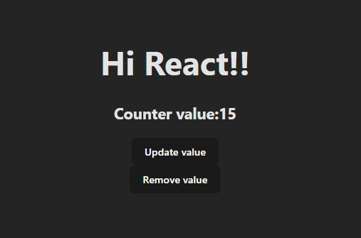
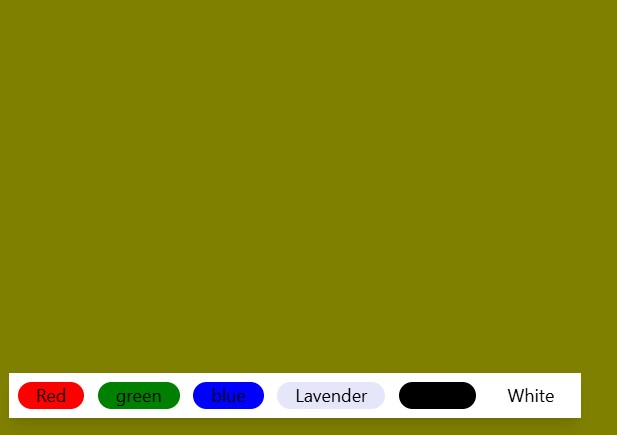
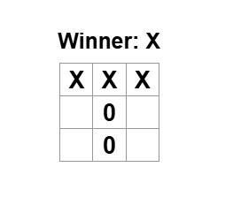
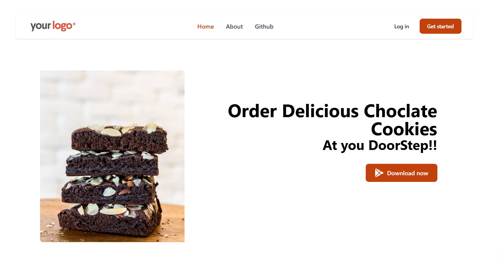

# Learning React through Projects

This repository documents my journey of learning React by building various projects.

---

## Projects

### 1. Counter Project
This is a simple project where we can update the state of counter variables using buttons.

#### **What I Learned**
- How to use the `useState` hook.
- Managing state variables effectively across a React application.

---
### 2. BgChanger Project
This is a simple project where we can Change the Bg color of the screen.

#### **What I Learned**
- How to use the `useState` hook.
- Managing state variables effectively across a React application.

---
### 3. Tic-tac-toe Project
Making of Tic tac toe game using React

#### **What I Learned**
- Got Familar with the React Syntax.

---

### 4. Landing page 
Making of a simple landing page and handling routing with React Router

#### **What I Learned**
- Learned how to create a Layout.jsx template.
- Learned how routing takes the user from one page to another.

---
---

### 5. Ev-Website
Made a Simple Ev-Website Displaying the models of a Ev-car Brand

## Project Demo 🎬
[View Video](https://raw.githubusercontent.com/hypedkiddo/React/main/assests/video.mp4)

#### **What I Learned**
- Used loops to show Media according to the buttons clicked by the user.
- Learned how to manage and integrate react components.

---

Stay tuned for more projects as I continue my learning journey!

